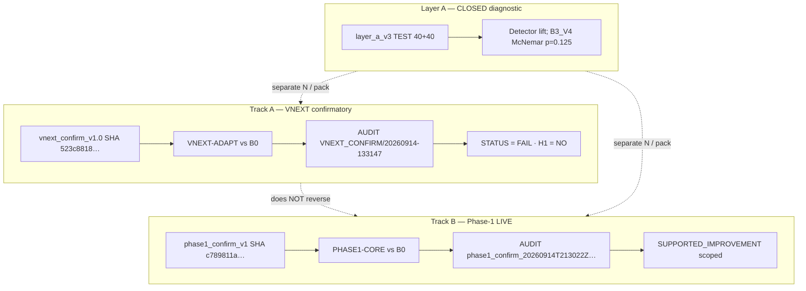

# Figures — Q1 findings manuscript (camera-ready captions)

**Source manuscript:** [`MANUSCRIPT.md`](MANUSCRIPT.md) · **Claims:** [`CLAIMS_MAP.md`](CLAIMS_MAP.md)  
**Do not** use these diagrams to imply one pooled “AdaptiGuard works” outcome.

---

## Figure 1 — Dual-track confirmatory architecture (mermaid)

**Suggested caption (camera-ready):**  
*Dual-track confirmatory design. Track A (VNEXT) and Track B (Phase-1 LIVE) use disjoint frozen packs, treatments, and AUDIT folders. Track A outcome is FAIL (immutable). Track B reports scoped SUPPORTED_IMPROVEMENT and does not reverse Track A. Layer A is a closed diagnostic on a third pack; not confirmatory for either track.*



**Export note (human):** Render mermaid to PDF/SVG per venue; keep Track A and Track B colors/labels distinct in the final figure.

---

## Figure 2 (optional) — Claim ceiling (ASCII)

**Suggested caption:**  
*Claim ceiling for this Q1 manuscript cycle (Q1-P2). Evidence base = Track A FAIL + Track B scoped only. Rows marked Future Work are out of scope unless optional Phase 3 budget adds new immutable AUDIT artifacts.*

```
+---------------------------+------------------+---------------------------+
| Evidence                  | This cycle       | Forbidden headline        |
+---------------------------+------------------+---------------------------+
| Track A VNEXT FAIL        | Must-have        | FAIL→PASS, "VNEXT works"  |
| Track B scoped improve.   | Must-have        | Reverses A, solve-PI      |
| Layer A diagnostic        | Must-have        | Pool with A/B ASR         |
| Dual-track + repro hashes | Must-have        | Unlabeled mixed tables    |
| Confirmatory V2 live      | Future Work      | Present as done           |
| AgentDojo-class loops     | Future Work      | Leaderboard claim         |
| External SOTA baselines   | Future Work      | SOTA table                |
| p1_mechanism live         | Future Work/P3   | Live mechanism claims     |
+---------------------------+------------------+---------------------------+
```

---

## Tables (text in manuscript)

| Table | Manuscript home | Rule |
| --- | --- | --- |
| Track A primary pair | §6.1 | B0 vs VNEXT-ADAPT only |
| Track B summary | §6.2 | PHASE1-CORE vs B0 only |
| Limitations vs P2 disposition | §8 | From [`Q1_BLOCKER_MATRIX.md`](../../experiments/Q1_BLOCKER_MATRIX.md) |

**Track A δ̂ row:** report point δ̂=0.0820; **95% CI for δ̂ not in AUDIT** (BLOCKING GAP)—do not add a CI column without an approved recompute artifact.
